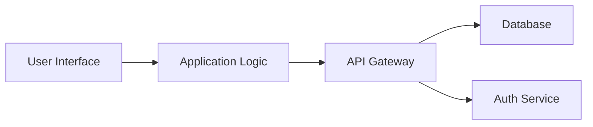
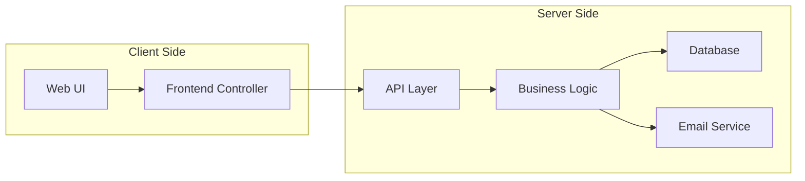
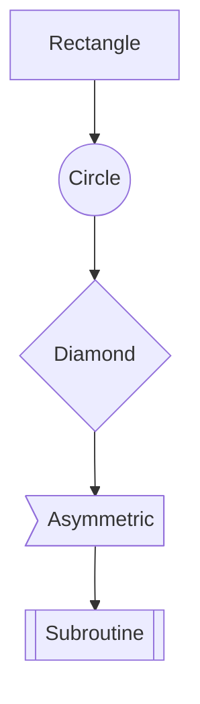
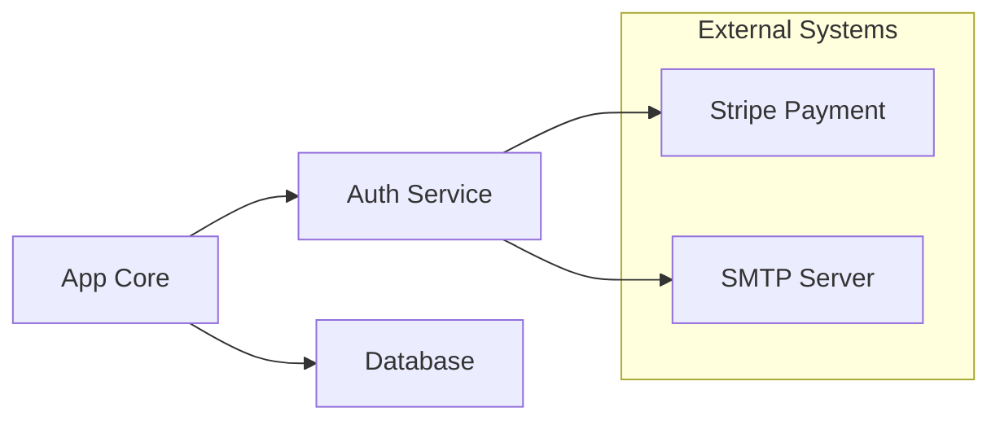

# 📦 Generic Block Diagrams with Mermaid

This document demonstrates how to create general-purpose block diagrams using [Mermaid](https://mermaid.js.org/)'s `flowchart` feature. GitHub renders these diagrams automatically.

---

## 📊 Basic Block Diagram



---

## 🧱 Block Diagram with Subsystems



---

## 🎨 Styled Block Diagram

```mermaid
flowchart LR
  A[Compute Node]:::compute --> B((Storage)):::storage
  A --> B

  classDef compute fill=#d3f,stroke=#333,stroke-width=2px;
  classDef storage fill=#fdd,stroke=#900,stroke-width=2px;
```

---

## 🧩 Node Shape Variants



---

## 📦 External Systems with Grouping



---

## 📚 Resources

- [Mermaid Docs](https://mermaid.js.org/syntax/flowchart.html)
- [GitHub Mermaid Support](https://github.blog/2022-02-14-include-diagrams-markdown-files-mermaid/)
